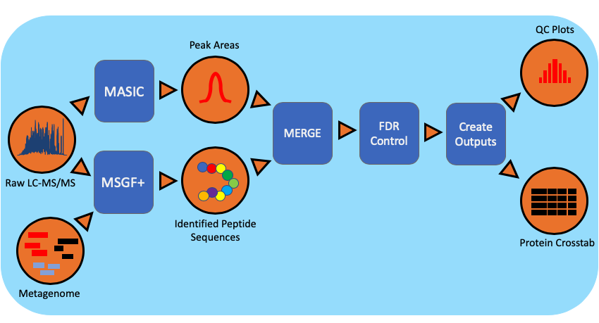

.. proteomics documentation master file, created by
   sphinx-quickstart on Wed Jul 29 11:48:19 2020.
   You can adapt this file completely to your liking, but it should at least
   contain the root `toctree` directive.

************************
Meta-proteomics workflow
************************

About
-----
*Meta-proteomics workflow/pipeline* is an end-to-end data processing and analyzing pipeline for studying proteomes i.e studying protein identification and characterization using MS/MS data.

We identify the active organisms/species in a metagenome corresponding to a wet-lab sample obtained from JGI after gene sequencing.

Then the researchers at PNNL culture these samples and make it appropriate to study it as a protein sample. This protein sample may have a single protein or a complex mixture of proteins.

Later, this sample is passed through a mass spectrometry instrument to obtain a proprietary data format .RAW file. This file contains MS/MS spectrum i.e mass analysis(mass-to-charge (m/z) ratios) for each peptide sequences identified in the sample.

Additionally, we need sequenced metagenomes for each datasets. Currently, The metagenomes are obtained from NERSC(JGI) in the of FASTA(`.faa`) files.

This workflow kicks in after .raw and .faa are available.

Table of Content
################
#. Components of workflow.

   #. :doc:`../components/1-processing`
   #. :doc:`../components/2-aggregatingAnalysis`
   #. :doc:`../components/3-reportgen`

#. Benchmarking.

   #. :doc:`../datasets/datasets`
   #. Execution time analysis

.. toctree::
   :maxdepth: 2
   :caption: Workflow description:

   ../components/components
   ../datasets/datasets
   modules

Please provide feedback Anubhav <anubhav@pnnl.gov>

Indices and tables
##################

* :ref:`genindex`
* :ref:`modindex`
* :ref:`search`
